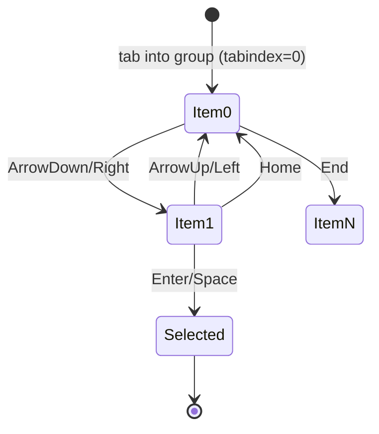

# Accessibility Strategy

Target: **WCAG 2.2 AA**. Accessibility is verified automatically (axe-core in
Playwright) and encoded in reusable primitives so correct behaviour is the default.

## Pillars

| Area                  | Implementation                                                                                                                                 |
| --------------------- | ---------------------------------------------------------------------------------------------------------------------------------------------- |
| Semantic HTML         | Native landmarks (`nav`, `main`), headings hierarchy, buttons for actions                                                                      |
| Keyboard navigation   | Roving-tabindex composite widgets via `nextRovingIndex` / `useRovingSelection`; Enter/Space activation via `onActivateKey` (`src/lib/a11y.ts`) |
| Focus management      | `RouteFocus` moves focus to the main heading on route change so screen-reader users are oriented after client navigation                       |
| ARIA                  | `role="radiogroup"/"radio"`, `role="listbox"/"option"`, `aria-checked`, `aria-selected`, `aria-label` on icon-only controls                    |
| Screen-reader support | Live status text for async AI results; descriptive labels on charts and rings                                                                  |
| Color & contrast      | Text/UI meets AA contrast; state is never conveyed by color alone                                                                              |
| Motion                | Animations are subtle; respect reduced-motion via CSS                                                                                          |

## Roving-tabindex pattern

`nextRovingIndex(key, current, count)` returns the next focus index (wrapping at
the ends, Home/End jumps) or `null` for non-navigation keys, keeping arrow-key
logic pure and unit-tested. Only the active item is in the tab order; arrows move
focus within the group — the standard APG radiogroup/listbox interaction.

## Automated verification

`e2e/accessibility.spec.ts` runs `@axe-core/playwright` against each route and
fails the build on any violation. This complements component-level assertions that
check ARIA attributes and keyboard handlers directly.

## Manual checklist (per feature)

- [ ] Reachable and operable with keyboard only
- [ ] Visible focus indicator at every step
- [ ] Labels/roles announced correctly by a screen reader
- [ ] Async results announced (live region / status text)
- [ ] No axe violations
