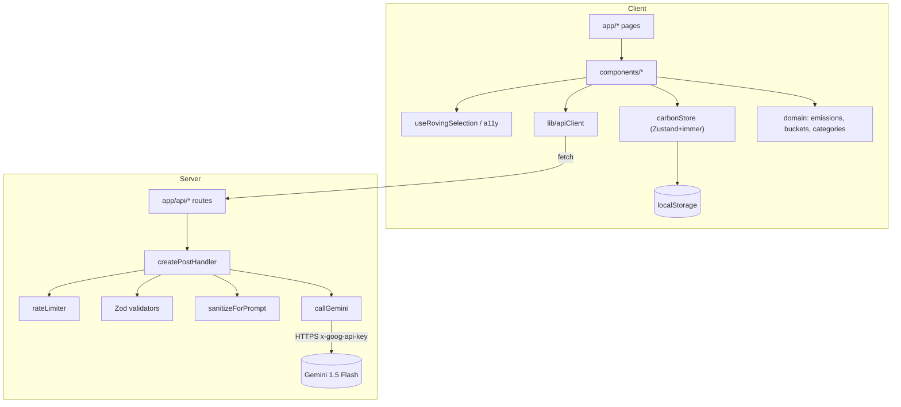
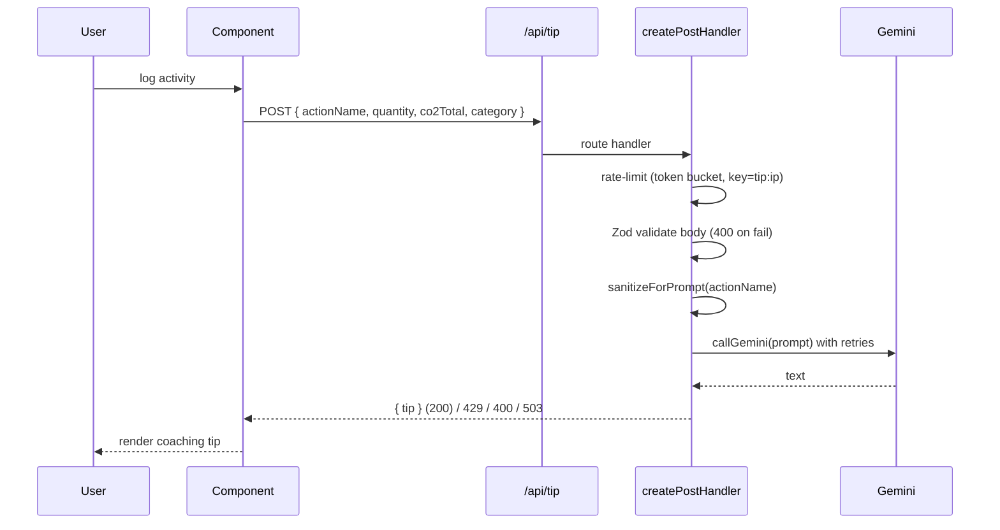

# Architecture

CarbonTrace is a Next.js 16 (App Router) application for logging daily activities,
estimating their CO₂e footprint, tracking goals/challenges, and surfacing
AI-generated coaching. It follows a layered, feature-oriented architecture with a
strict separation between UI, domain logic, server-only services, and state.

## Layers

| Layer        | Location                                                      | Responsibility                                            | Depends on           |
| ------------ | ------------------------------------------------------------- | --------------------------------------------------------- | -------------------- |
| Presentation | `src/app/**`, `src/components/**`                             | Routing, rendering, user interaction                      | hooks, domain, types |
| Hooks        | `src/lib/useRovingSelection.ts`                               | Reusable stateful UI behaviour                            | domain, types        |
| Domain       | `src/lib/{emissions,buckets,categories,topCategory,utils}.ts` | Pure business logic, no I/O                               | types                |
| Validation   | `src/lib/validators.ts`                                       | Zod schemas — the single source of input/output contracts | zod                  |
| Security     | `src/lib/{sanitize,rateLimiter}.ts`, `src/lib/apiHandler.ts`  | Cross-cutting request hardening                           | validators           |
| Services     | `src/lib/gemini.ts`, `src/app/api/**`                         | Server-only LLM calls and HTTP endpoints                  | security, validation |
| State        | `src/store/carbonStore.ts`                                    | Client persistence (Zustand + immer)                      | types                |
| Types        | `src/types/index.ts`                                          | Shared domain model                                       | —                    |

Dependencies point inward only: presentation may import domain, but domain never
imports React or Next. Domain modules are pure and trivially testable.

## Module diagram

## Request data flow (AI tip)

## Key design decisions

- **Handler factory (`createPostHandler`)** centralizes rate limiting, parsing,
  validation, and uniform error mapping so each route declares only its schema and
  domain logic — Single Responsibility + Open/Closed.
- **Pure domain modules** keep emission math, bucketing, and category aggregation
  free of framework concerns, enabling fast unit + property-based tests.
- **Validators as contracts** (`src/lib/validators.ts`) are the one place input and
  even _LLM output_ shapes are defined, then reused by routes and the client.
- **Server-only services**: `gemini.ts` reads `GEMINI_API_KEY` and must never be
  imported from a client component; the key travels in a header, not the URL.
- **Client state** is local-first (Zustand `persist` + `immer`), bounded (goals
  capped at 10) and serialized to `localStorage`.

See [security.md](./security.md), [testing.md](./testing.md),
[accessibility.md](./accessibility.md), [performance.md](./performance.md), and
[ai-design.md](./ai-design.md) for cross-cutting concerns.
