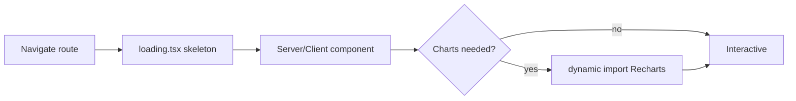

# Performance

CarbonTrace targets fast first load and smooth interaction with a small, mostly
client-side workload.

## Strategy

| Technique                     | Where                                                                                  | Benefit                                               |
| ----------------------------- | -------------------------------------------------------------------------------------- | ----------------------------------------------------- |
| Code splitting / lazy loading | `src/components/charts/lazy.tsx` defers Recharts (a heavy dep) until charts are needed | smaller initial JS, faster TTI                        |
| Route-level loading states    | `app/*/loading.tsx`                                                                    | instant navigation feedback (streaming/Suspense)      |
| Render memoization            | pure domain selectors + stable callbacks feed components                               | avoids redundant re-renders                           |
| Pure domain functions         | `src/lib/*`                                                                            | cheap, cacheable computation off the render path      |
| Local-first state             | Zustand + `localStorage`                                                               | no network on read; bounded data (goals capped at 10) |
| Bounded server work           | token-bucket rate limiting + retry-with-backoff                                        | predictable latency, protects upstream LLM            |

## Loading model



## Budgets & guidance

- Keep heavy visualization libraries behind dynamic imports (`charts/lazy.tsx`).
- Keep domain logic pure so results can be memoized and tested without a DOM.
- Prefer derived selectors over storing computed state in the store.
- Avoid blocking the main thread; AI calls are async with retry/backoff and never
  gate initial render.

## Measuring

```bash
npm run build      # production bundle + route sizes
npm run test:e2e   # Playwright captures real navigation timing
```

Watch the per-route JS sizes from `next build`; regressions usually mean a heavy
dependency leaked into the initial bundle instead of being lazy-loaded.
