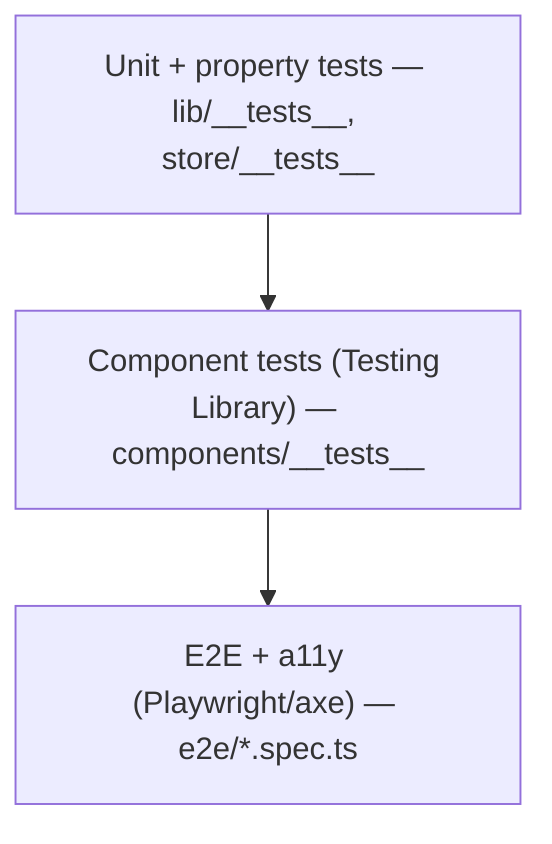

# Testing Strategy

## Tooling

- **Vitest** (jsdom) + **Testing Library** for unit/component tests.
- **fast-check** style property assertions for pure domain invariants.
- **Playwright** + **@axe-core/playwright** for E2E and accessibility audits.
- **v8 coverage** with enforced thresholds in `vitest.config.mts`.

> **Node version**: tests require Node ≥ 20.19 (see `.nvmrc`). Older Node
> (< 20.19) cannot `require()` the ESM-only transitive dependency used by jsdom and
> the suite will fail to start. Run `nvm use` first.

## Test pyramid



## What each layer covers

| Layer           | Files                                          | Focus                                                                                              |
| --------------- | ---------------------------------------------- | -------------------------------------------------------------------------------------------------- |
| Unit / property | `src/lib/__tests__/*`, `src/store/__tests__/*` | emission math, bucketing, category aggregation, validators, sanitize, rate limiter, store reducers |
| Component       | `src/components/__tests__/*`                   | rendering, keyboard interaction, ARIA wiring, callback contracts                                   |
| API             | `src/app/api/__tests__/routes.test.ts`         | rate-limit/validation/error mapping through `createPostHandler`                                    |
| E2E + a11y      | `e2e/*.spec.ts`                                | real user flows + axe WCAG scans; covers browser-only chart wrappers                               |

## Coverage policy

Enforced thresholds (`vitest.config.mts`): **statements 98 / lines 99 / functions
98 / branches 88**. Current: ~99% statements, 100% lines, ~99% functions, ~97%
branches. Browser-only Recharts wrappers and the dynamic loader are excluded from
unit coverage and exercised via Playwright instead.

## Principles

- **Test behaviour, not implementation** — queries are by role/label, mirroring
  how users and assistive tech perceive the UI.
- **Edge cases** — empty/boundary quantities, negative offsets (carbon savings),
  rate-limit refill timing, eviction, and malformed input are explicitly tested.
- **Property-based invariants** — pure domain functions are checked across
  generated inputs (e.g. emission totals are monotonic in quantity, bucketing
  partitions inputs exhaustively).
- **Mutation resistance** — assertions check exact computed values and error
  codes, not just "truthiness", so logic mutations are caught.

## Running

```bash
nvm use                 # Node 20.19+
npm test                # unit + component + api
npm run test:coverage   # with thresholds
npm run test:e2e        # Playwright E2E + a11y
```
